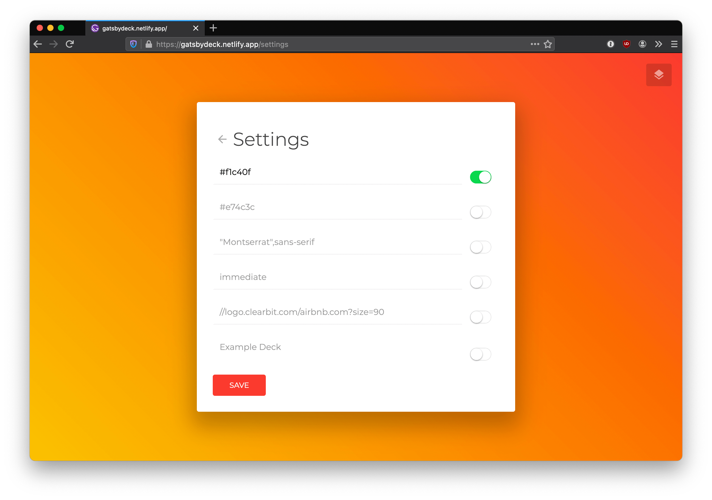

# Gatsby Keynote (was: Gatsby Deck)

###### :warn: This project is a WIP

## Build a slide deck with Gatsby!

### A little backstory

I developed Gatsby Keynote (was: Gatsby Deck) for a presentation I held at my workplace; we have this nice format called "Talks" that lets us present to our colleagues on any topic we're interested in. Being a Gatsby enthusiast, I decided my talk would be **"Intro to Gatsby".**

As I was thinking about how to deliver the presentation in an interesting way, I had this fun (kinda meta) idea: _what if the presentation medium, i.e. my keynote, was a Gatsby app itself?_

I would go through the presentation like it was an ordinary keynote, and then, at the very last slide... BOOOM, I'd summon my IDE via a deep link and proceed to the big reveal: the presentation about Gatsby you've been watching is indeed a Gatsby app!

This is the first POC I developed when looking for a way to use arrow keys to control a series of markdwn-based slides, programmatically turned to app pages.

The rest of the job was split between carefully crafting an exact replica of my company's PowerPoint template in SCSS (remember, it had to look like the real thing!), and creating the content. I had a lot of fun building this project.

---

### A note on naming (or, there's no such thing as being "original")

The project was originally named "Gatsby Deck", but I'm changing it to "Gatsby Keynote". Why? Gatsby Deck seemed like a perfect name and I was so convinced my idea was _100% NEW AND ORIGINAL_. I couldn't wait to build a Gatsby theme out of it.

Well, turns out, when I was in the process of choosing a custom Netlify slug (gatsby-deck), it was taken. And the project it hosted... was an implementation of the exact same idea (albeit much simpler UI-wise), with the exact same name. And that project, was in turn inspired by another one, and so on. Just some minutes ago I discovered that also gatsby-slides is taken! : ) You get the idea.

This served as a reminder that it's nearly impossible to conceive something truly original in our hyperconnected, overcrowded, but yet so fascinating digital space.

Anyway, I'll still build my keynotes in Gatsby -- it's awesome : )

---

### What's next

I wanted to create a Gatsby theme, but then after realizing the world hardly needs another project like this, I put it on hold. Nonetheless, I improved the UI with navigation controls, a settings pane, and new slide formats.

